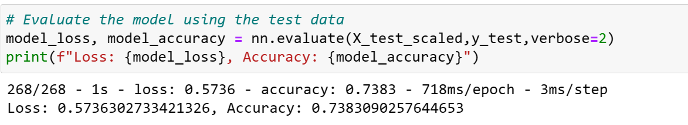

# Challenge 21: Building a deep learning model using TensorFlow

## Overview

- The purpose of this assignment is to build a deep learning model to predict whether applicants will be successful or not if funded by Alphabet Soup. This model will analyze the dataset from the company containing over 34000 organizations that have received funding from Alphabet Soup over the years.
- This model will therefore help predict the success of the applicants so that the company would help fund the ventures with best chance of success.

## Results

### Data Preprocessing
- Removed variables
  - EIN : Used only for identification hence not neither a feature nor target
  - NAME :  Used only for identification hence not neither a feature nor target
- Feature variables
  - APPLICATION_TYPE : Alphabet Soup application type
  - AFFILIATION : Affiliated sector of industry
  - CLASSIFICATION : Government organization classification
  - USE_CASE : Use case for funding
  - ORGANIZATION : Organization type
  - STATUS : Active status
  - INCOME_AMT : Income classification
  - SPECIAL_CONSIDERATIONS : Special considerations for application
  - ASK_AMT : Funding amount requested
- Target variables
  - IS_SUCCESSFUL : Was the money used effectively
- Binning (for columns more than 10 unique values)
  - APPLICATION_TYPE: 17 unique values (Value counts below 500 merged as Others)
  - CLASSIFICATION: 71 unique values (Value counts below 300 merged as Others)
  
  
  
- Categorial data to numeric data
  - Performed `pd.get_dummies()` to convert to numeric data
    
- Split dataset
  - We splitted the dataframe into 2 sets: features set(`X`) and target set(`y`)
  - We splitted the dataset to training and test data set using train_test_split.
  - Additionally, we scaled the same using StandardScaler 
  
### Compiling, Training, and Evaluating the Model

- We performed 4 attempts to increase the performance of the model's performance. However, we were unable to achieve target accuracy of 75%.
- This was achieved by changing the neuron counts in hidden layers, changing number of hidden layers, changing activation function, increaseing epochs.
- However, we were able to achieve maximum accuracy of <<percent>>%

#### Results

- Model 1
  - Accuracy:73.73%  Loss: 0.5510
    
  - Model structure  
    - Layers:
      - Layer 1:
        - Number of neurons: 80
        - Activation function: relu
      - Layer 2:
        - Number of neurons: 80
        - Activation function: relu
      - Output Layer
        - Activation function: sigmoid
    - Epochs: 100 
    - Optimzer: adam

- Model 2
  - Accuracy: 73.89%   Loss: 0.5689
    
  - Model structure  
    - Layers:
      - Layer 1:
        - Number of neurons: 100
        - Activation function: relu
      - Layer 2:
        - Number of neurons: 90
        - Activation function: relu
      - Layer 3:
        - Number of neurons: 80
        - Activation function: relu     
      - Output Layer
        - Activation function: sigmoid
    - Epochs: 100
 
    - Optimzer: adam

- Model 3
  - Accuracy: 73.61%  Loss: 0.5611
    
  - Model structure  
    - Layers:
      - Layer 1:
        - Number of neurons: 100
        - Activation function: relu
      - Layer 2:
        - Number of neurons: 100
        - Activation function: relu
      - Layer 3:
        - Number of neurons: 80
        - Activation function: sigmoid
      - Output Layer
        - Activation function: sigmoid
    - Epochs: 100
    - Optimzer: adam
   

- Model 4
  - Accuracy: 73.71%   Loss: 0.5675
    
  - Model structure  
    - Layers:
      - Layer 1:
        - Number of neurons: 100
        - Activation function: relu
      - Layer 2:
        - Number of neurons: 80
        - Activation function: relu
       - Layer 3:
        - Number of neurons: 30
        - Activation function: relu
      - Output Layer
        - Activation function: sigmoid
    - Epochs: 150
    - Optimzer: adam

### Summary

- After making the above attempts, we were able to achieve maximum accuracy of <<<X>>>%. However, sadly, we were unable to get an accuracy of 75%.
- Also, during the above attempts we used default values for optimzers like learning rate. May be we could try changing the learning rate to achieve better accuracy.
- It would be recommended to try other machine learning classification models for this analysis to increase accuracy. We can possibly try Random Forest classifier which uses averaging to improve accuracy as well as control over-fitting.
